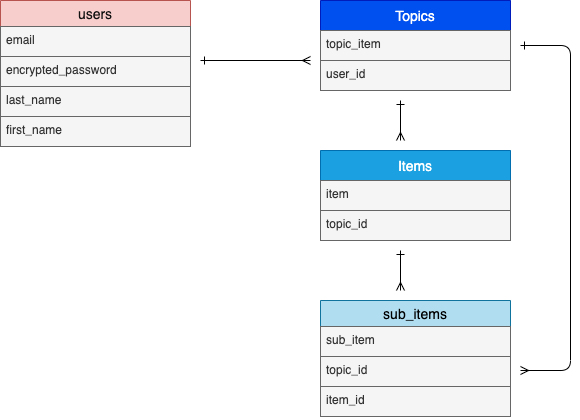
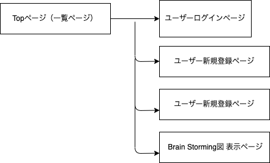

# アプリケーション名
Brain Storming

# アプリケーション概要
ToDoリストで投稿したアイテムを並び替えることで、アイテムごとの関連づけや、
優先順位の確認ができる。

# URL
https://brain-storming.onrender.com/

# テスト用アカウント
- Basic認証パスワード :2222
- Basic認証ID :admin
- メールアドレス :test@test.com
- hhh111

# 利用方法
## ToDo投稿とitem入れ替え
1,トップページのヘッダーからユーザー新規登録を行う
2,Topic投稿ボタンから、Topicを投稿する
3,Topicを連続で投稿したり、topicに紐付けるitemを投稿する
4,投稿されたitemをドラッグで入れ替えて、より関連性を視覚化する

# アプリケーションを作成した背景
個人的にスマートフォンなどに搭載されているToDoアプリに不満があり、
よくメモアプリを使っていたが、メモアプリだと項目が増え、リストになった場合、
項目の関連性をいちいち見直さないといけなく、管理しづらかった為、開発を決めた。

# 洗い出した要件
[要件を定義したシート](https://docs.google.com/spreadsheets/d/1RjEaaToBftxu9LI8wmmkix5x6j5-KBM_oRrOaJS_fKA/edit#gid=982722306)

# 実装した機能についての画像やGIFおよびその説明※

# 実装予定の機能

# データベース設計

## users テーブル

| Column                  | Type          | Options                        |
| -------------------     | --------      | ------------------------------ |
| email                   | string        | null: false, unique: true |
| encrypted_password      | string        | null: false                    |
| last_name               | string        | null: false                    |
| first_name              | string        | null: false                    |

### Association
- has_many :Topics

## Topics テーブル

| Column                        | Type          | Options                        |
| -------------------     | --------    | ------------------------------ |
| user                              | references | null: false, foreign_key: true |
| topic_item                    | string         | null: false                    |

### Association
- belongs_to :user
- has_many   :items
- has_many   :sub_items

## items テーブル

| Column        | Type       | Options                        |
| ------------ | ---------- | ------------------------------ |
| topic             | references | null: false, foreign_key: true |
| item              | string         | null: false                    |

### Association
- belongs_to :topic
- has_many   :sub_items

## sub_items テーブル

| Column        | Type       | Options                        |
| ------------ | ---------- | ------------------------------ |
| topic             | references | null: false, foreign_key: true |
| item              | references | null: false, foreign_key: true |
| sub_item      | string         | null: false                    |

### Association
- belongs_to :topic
- belongs_to :item

# 画面遷移図

# 開発環境
- フロントエンド
- バックエンド
- インフラ
- テスト
- テキストエディタ
- タスク管理

# ローカルでの動作方法
以下のコマンドを順に実行

% git clone https://github.com/hama-hiroki/brain-storming

% cd xxxxx

% bundle install

% yarn install

# 工夫したポイント
ToDoリストを並び替えて関連づけをする機能は、あくまでアプリ作成の骨組みで、これを主婦向けの献立・買い物リストアプリにしたり、ビジネス優先順位整理アプリにしたり、汎用性のあるものになると考えている。
